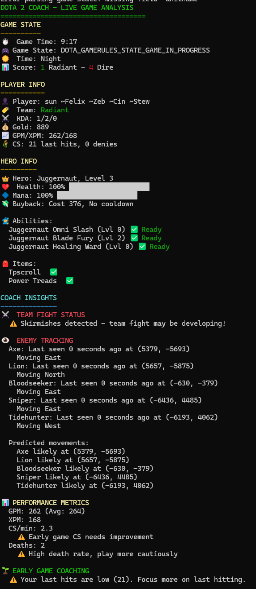

# Dota 2 Coach

A real-time CLI coaching tool for Dota 2 players that leverages Game State Integration (GSI) to provide actionable insights during gameplay.

## Features

- **Real-time Game Analysis**: Monitors your game state and provides tailored advice based on the current phase of the game
- **Player Performance Tracking**: Tracks your CS, GPM, XPM, and other critical metrics
- **Enemy Hero Tracking**: Detects enemy heroes on the minimap and predicts their movements
- **Team Fight Analysis**: Assesses team fight readiness and alerts you when team fights are happening
- **Item Recommendations**: Suggests item purchases based on available gold and game context
- **Timing Reminders**: Provides timely reminders for stacking camps, rune spawns, and other time-sensitive objectives

## Screenshots



## Installation

### Prerequisites

- Dota 2 with Game State Integration enabled
- Rust (latest stable version recommended)

### Step 1: Set up Game State Integration

1. Navigate to your Dota 2 configuration directory:
   ```
   Windows: C:\Program Files (x86)\Steam\steamapps\common\dota 2 beta\game\dota\cfg\
   Linux: ~/.steam/steam/steamapps/common/dota 2 beta/game/dota/cfg/
   ```

2. Create a file named `gamestate_integration_coach.cfg` with the following contents:
   ```
   "dota2-coach Configuration"
   {
       "uri"               "http://127.0.0.1:3000/"
       "timeout"           "5.0"
       "buffer"            "0.1"
       "throttle"          "0.1"
       "heartbeat"         "30.0"
       "data"
       {
           "buildings"     "1"
           "provider"      "1"
           "map"           "1"
           "player"        "1"
           "hero"          "1"
           "abilities"     "1"
           "items"         "1"
           "draft"         "1"
           "wearables"     "1" 
           "minimap"       "1"
           "all"           "1"
       }
       "auth"
       {
           "token"         "coach123"
       }
   }
   ```

3. Add `-gamestateintegration` to your Dota 2 launch options:
   - Open Steam
   - Right-click on Dota 2 and select "Properties"
   - Click "Set Launch Options..."
   - Add `-gamestateintegration` to the text field
   - Click "OK"

### Step 2: Build and Run the Coach

1. Clone this repository:
   ```
   git clone https://github.com/yourusername/dota2-coach.git
   cd dota2-coach
   ```

2. Build the project:
   ```
   cargo build --release
   ```

3. Run the coach:
   ```
   cargo run --release --bin coach
   ```

4. Start Dota 2 and play a game. The coach will begin providing insights once the game starts.

## Usage

The coach automatically displays the following information:

- **Game State**: Current time, phase, score, and other critical information
- **Player Info**: Your KDA, gold, net worth, CS, and other stats
- **Hero Info**: Your hero's health, mana, abilities, items, and status effects
- **Coach Insights**: Phase-specific advice, timing reminders, and strategic suggestions

The interface updates automatically as you play, providing real-time feedback and advice.

## Troubleshooting

### No GSI Data Being Received

1. Verify that your GSI configuration file is correctly placed
2. Ensure Dota 2 is launched with the `-gamestateintegration` flag
3. Check that your firewall isn't blocking the local server
4. Restart Dota 2 and the coach application

### Parse Errors or Incorrect Data

1. Check if you're using a supported Dota 2 version
2. Try enabling debug mode in the coach application (modify `DebugMode::new(true)` in `coach.rs`)
3. Submit an issue with the debug logs attached

## Contributing

Contributions are welcome! Please feel free to submit a Pull Request.

## TODOs

1. **Add Dota 2 hero minimap icons for visibility**
   - Integrate hero portrait images for clearer enemy tracking
   - Show minimap-style hero icons instead of text descriptions
   - Implement a small graphical representation of the Dota 2 map

2. **Get pro gameplay data for live state analysis and recommendation**
   - Collect and analyze professional player data for benchmarking
   - Compare player performance with professional averages
   - Provide item build and skill recommendations based on high-level play

3. **Fix ability bug - at level 0 it says ready**
   - Correct the display logic for abilities that haven't been skilled
   - Add proper handling for unlearned abilities
   - Implement better ability status visualization

4. **Make enemy tracking show an easier to understand reference to my current position**
   - Add relative positioning (North, South, etc. from player)
   - Show distance in more intuitive terms (e.g., "nearby", "medium distance", "far away")
   - Add directional indicators instead of raw coordinates

5. **Improve performance metrics displays**
   - Add visual charts for GPM/XPM trends
   - Implement comparison with previous game averages
   - Develop more accurate benchmarks based on hero and role

6. **Enhance team fight detection**
   - Improve the accuracy of team fight detection algorithm
   - Add post-team fight analysis (damage dealt, kill participation, etc.)
   - Provide pre-team fight advice based on positioning and cooldowns

## License

[Mozilla Public License Version 2.0](LICENSE)

## Acknowledgments

- Valve for providing the Game State Integration API
- The Dota 2 community for inspiration and feedback
